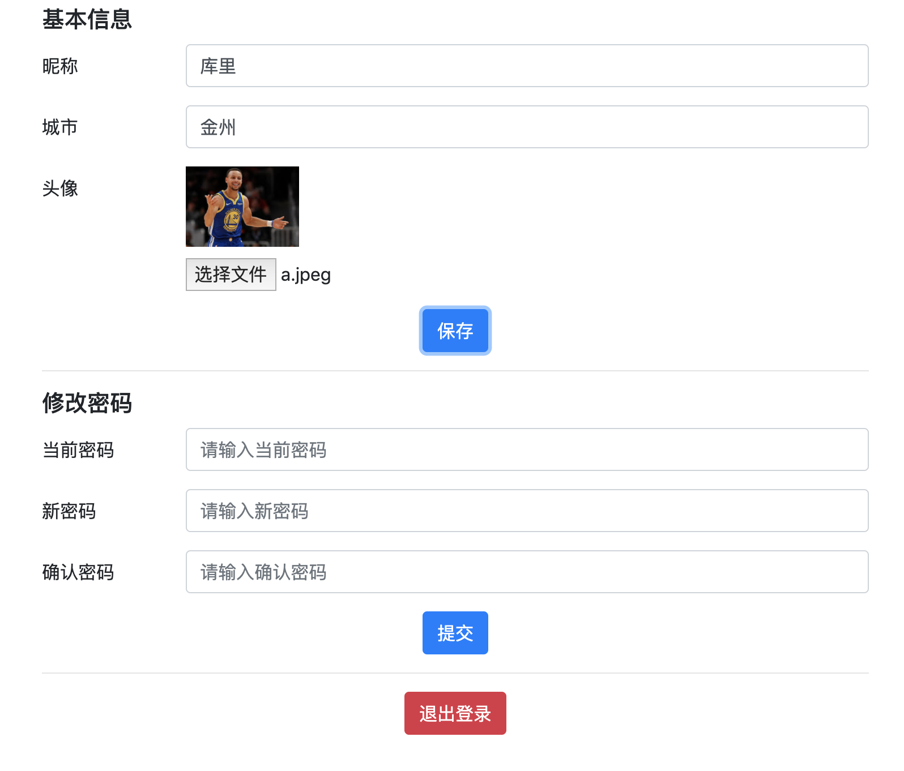

<!--
 * @Author: your name
 * @Date: 2020-03-30 00:10:05
 * @LastEditTime: 2020-04-18 16:42:56
 * @LastEditors: Please set LastEditors
 * @Description: In User Settings Edit
 * @FilePath: /koa2-weibo/README.md
 -->
# 实现一个简易新浪微博

先看下效果图：

登陆页面：

注册页面：

首页：

广场：

我的空间：

设置：

### 技术选型：koa2+mysql+session+ejs+redis+jest

### 创建数据库:

1. 创建数据库koa2_weibo_db
2. users表

| Column   | Type        | 主键 | 是否不为空 | 自动增加 | Default | 注释   |
| -------- | ----------- | ---- | ---------- | -------- | ------- | ------ |
| id       | int         | Y    | Y          | Y        |         | 主键id |
| username | varchar(20) |      | Y          |          |         | 用户名 |
| password | varchar(20) |      | Y          |          |         | 密码   |
| nickname | varchar(10) |      | Y          |          |         | 昵称   |

3.blogs表

| column  |    Type     | 主键 | 是否不为空 | 自动增加 | Default | 注释   |
| :-----: | :---------: | :--: | :--------: | :------: | :-----: | ------ |
|   id    |     int     |  Y   |     Y      |    Y     |         | 主键id |
| tiitle  | varchar(50) |      |     Y      |          |         | 标题   |
| content |    text     |      |     Y      |          |         | 内容   |
| userid  |     int     |      |     Y      |          |         | 用户id |

4.粉丝表

|   column   | Type | 主键 | 是否不为空 | 自动增加 | default | 注释         |
| :--------: | :--: | :--: | :--------: | :------: | :-----: | ------------ |
|     id     | int  |  Y   |     Y      |    Y     |         | 主键id       |
|   userId   | int  |      |     Y      |          |         | 用户id       |
| followerId | int  |      |     Y      |          |         | 被关注用户id |

5.@用户表

| columnd | type | 主键 | 是否不为空 | 自动增加 | Default | 注释     |
| :-----: | ---- | ---- | ---------- | -------- | ------- | -------- |
|   id    | int  | Y    | Y          | Y        |         | 主键id   |
| userId  | int  |      | Y          |          |         | 用户id   |
| blogId  | int  |      | Y          |          |         | 博客id   |
| isRead  | Bool |      | Y          |          |         | 是否阅读 |

### 安装
npm install

### 开启
+ redis-server
+ npm run dev

